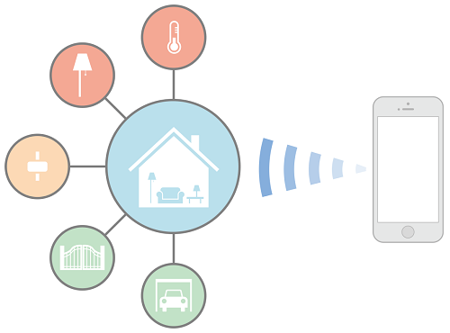

# 简介

该文档旨在帮你编写 HomeKit app。HomeKit 库是用来沟通和控制家庭自动化配件的，这些家庭自动化配件都支持苹果的 HomeKit Accessory Protocol。HomeKit 应用程序可让用户发现兼容配件并配置它们。用户可以创建一些 action 来控制智能配件（例如恒温或者光线强弱），对其进行分组，并且可以通过 Siri 触发。HomeKit 对象被存储在用户 iOS 设备的数据库中，并且通过 iCloud 还可以同步到其他 iOS 设备。HomeKit 支持远程访问智能配件，并支持多个用户设备和多个用户。HomeKit 还对用户的安全和隐私做了处理。

注意：如果你是开发设计 HomeKit 硬件的供应商，你可以去 Hardware Developers 下的 HomeKit 页面了解 MFi Program 相关信息，也可以阅读 External Accessory Programming Topics 另请参阅.

以下资源提供了更多关于创建 HomeKit 应用程序的信息：

1. HomeKit User Interface Guidelines 提供了用户界面设计指南
2. App Store Review Guidelines: HomeKit 提供了加快 app 审核的技巧
3. HomeKit Framework Reference 描述了 HomeKit 框架中的类和方法
4. External Accessory Framework Reference 列出了系统提供的发现和配置无线智能家居产品 UI
5. HomeKit Catalog 提供示例演示 HomeKit 特性
6. WWDC 2014: Introducing HomeKit 对 HomeKit 更高层次的分析
7. iOS Security 描述 HomeKit 如何处理 iOS 上的安全和隐私